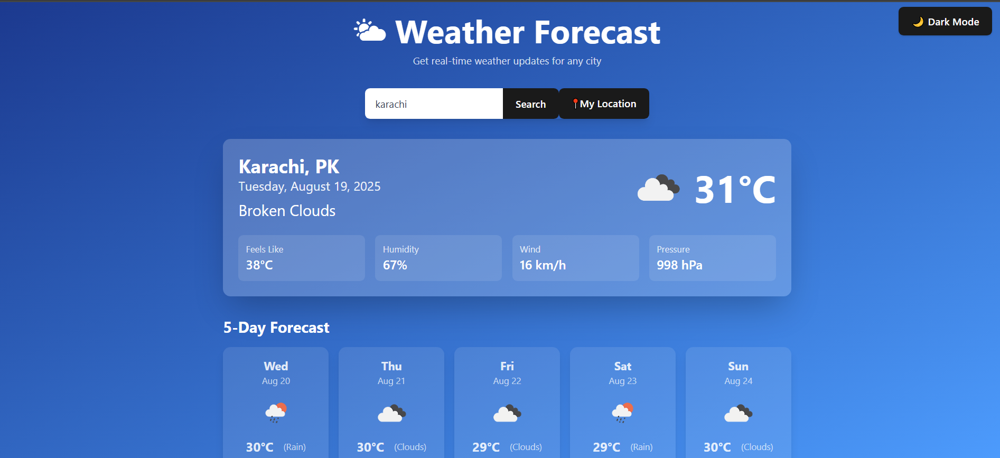

# 🌤️ Weather Forecast App

A modern and responsive **Weather Forecast Application** built with **React + Tailwind CSS**.  
It lets users search weather by **city name** or get real-time weather using **current location**.  
The app supports **light/dark mode**, displays **current weather**, and shows a **5-day forecast**.

---

## ✨ Features

- 🔎 Search weather by **city name**  
- 📍 Get weather using **your current location (Geolocation API)**  
- 🌗 **Light/Dark Mode** toggle with smooth gradient backgrounds  
- 🌡️ **Current weather**: temperature, feels like, humidity, wind, pressure  
- 📅 **5-Day forecast** (daily weather at 12:00 PM)  
- 🎨 Modern UI with Tailwind CSS & responsive design  
- ⚡ Loading spinner while fetching data  

---

## 🛠️ Tech Stack

- [React.js](https://react.dev/) – Frontend framework  
- [Tailwind CSS](https://tailwindcss.com/) – Styling  
- [OpenWeather API](https://openweathermap.org/) – Weather data  
- [Geolocation API](https://developer.mozilla.org/en-US/docs/Web/API/Geolocation_API) – Detect user location  

---
